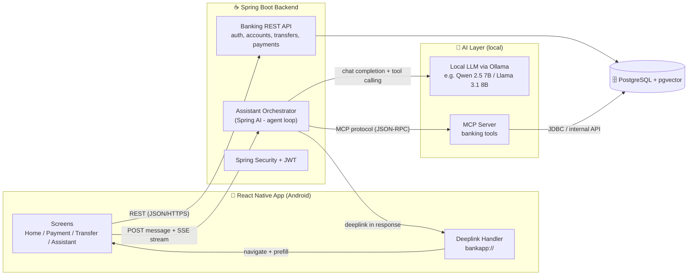
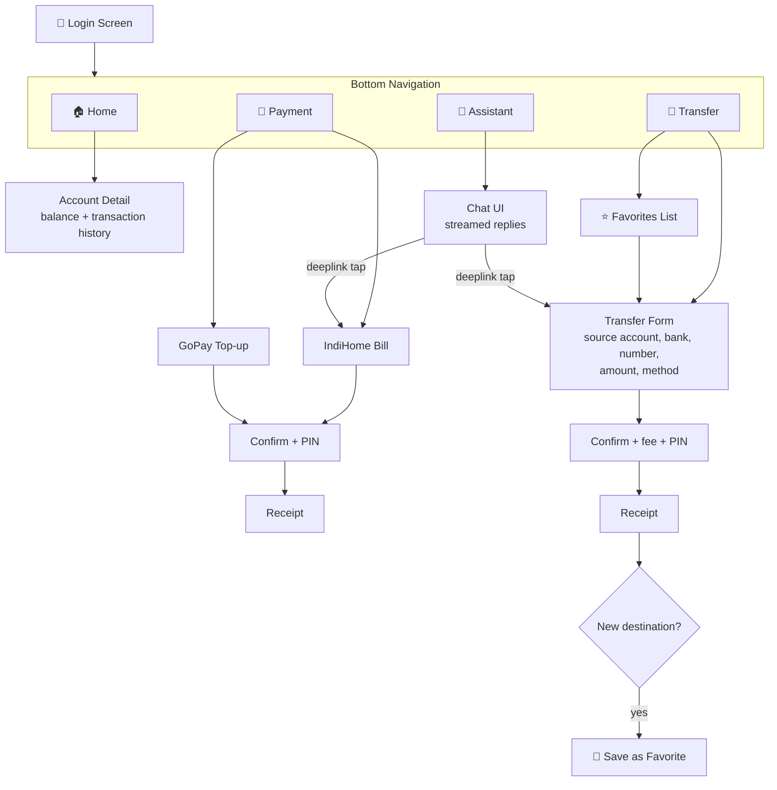
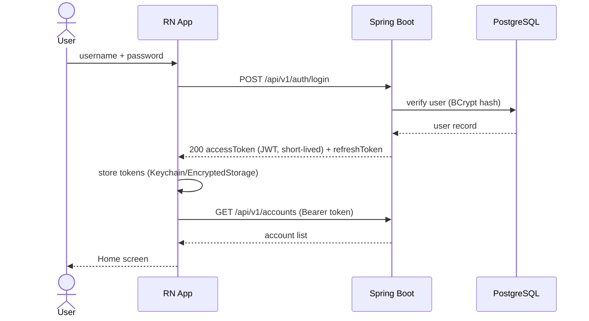
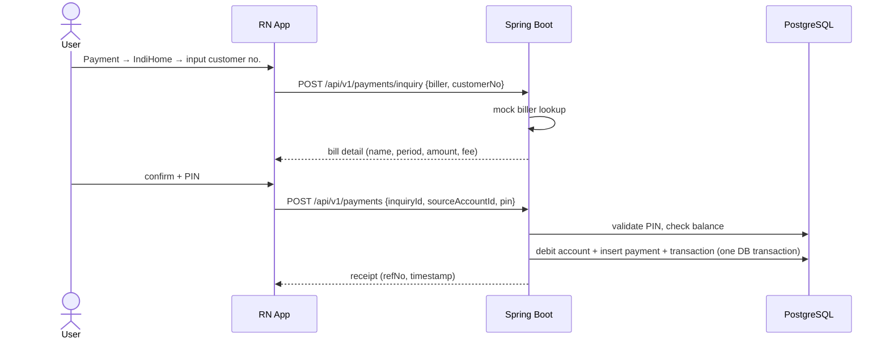
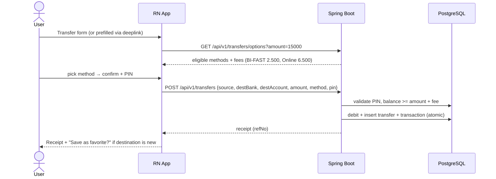
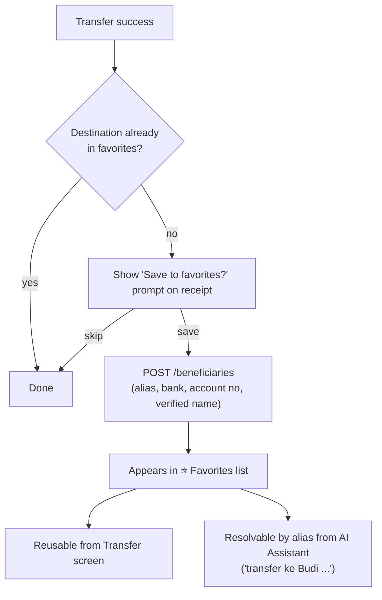
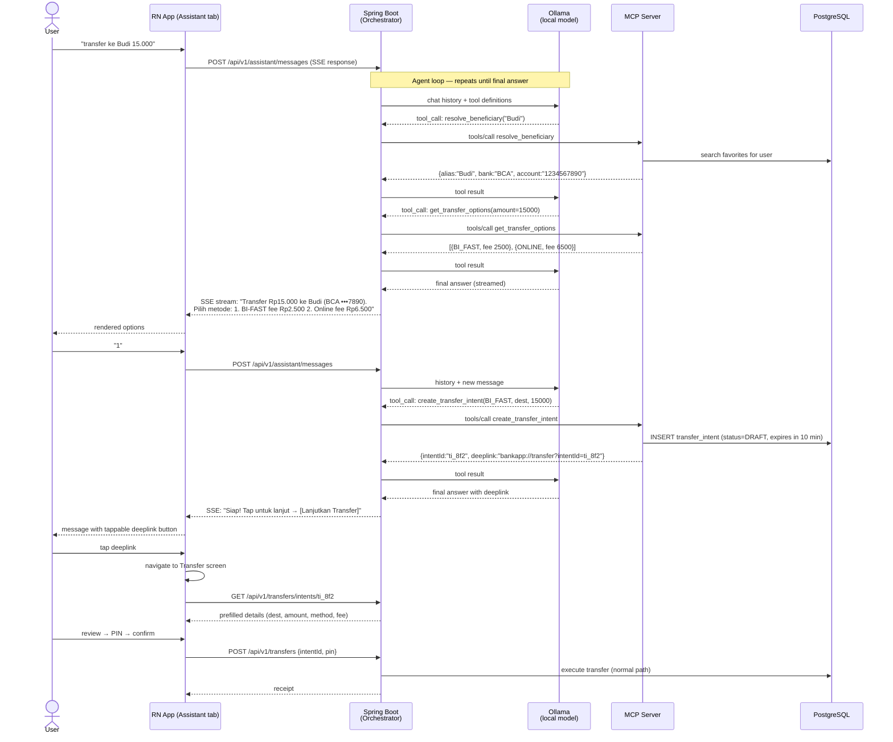
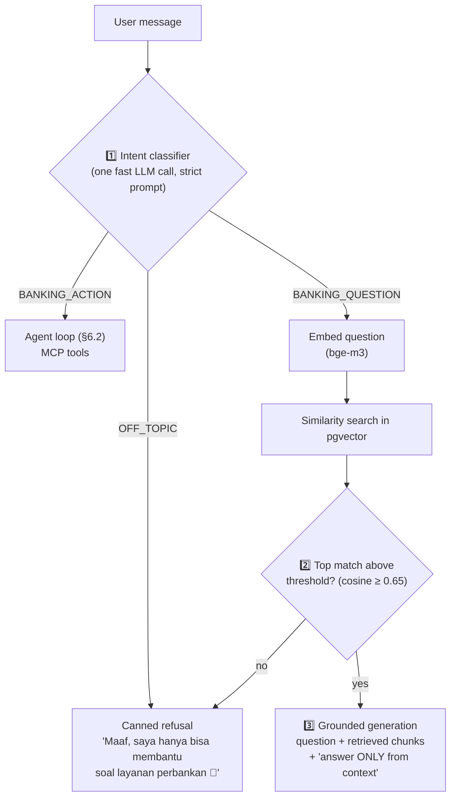
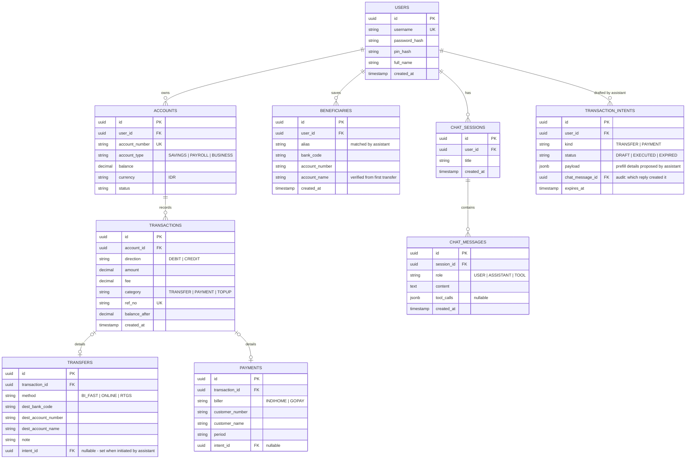
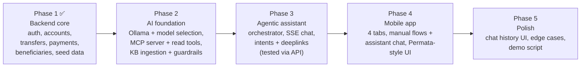

# Banking AI Assistant

A mobile banking **prototype** (Android, React Native) inspired by Permata Bank's mobile app UI, with a built-in **agentic AI Assistant** as its flagship feature. The assistant understands natural-language requests (e.g. *"transfer ke Budi 15.000"*), reasons over the user's real banking data through an **MCP server** backed by a **local LLM**, and hands control back to the user via **deeplinks** into pre-filled app screens — the user always confirms and executes the transaction themselves.

> ⚠️ **Prototype disclaimer** — this project is for learning/portfolio purposes. It simulates banking flows with a real database, but it is not connected to any real payment rail (BI-FAST, RTGS, ATM Bersama) and must not be used with real financial data.

---

## Table of Contents

1. [Core Features](#1-core-features)
2. [High-Level Architecture](#2-high-level-architecture)
3. [Tech Stack](#3-tech-stack)
4. [Mobile App — Screens & Navigation](#4-mobile-app--screens--navigation)
5. [Feature Specifications & Flows](#5-feature-specifications--flows)
   - [5.1 Login](#51-login)
   - [5.2 Accounts (Home)](#52-accounts-home)
   - [5.3 Payment](#53-payment)
   - [5.4 Transfer (3 methods)](#54-transfer-3-methods)
   - [5.5 Favorites / Beneficiaries](#55-favorites--beneficiaries)
6. [AI Assistant — The Main Feature](#6-ai-assistant--the-main-feature)
   - [6.1 Concept & Design Principles](#61-concept--design-principles)
   - [6.2 End-to-End Agentic Flow](#62-end-to-end-agentic-flow)
   - [6.3 MCP Server & Tools](#63-mcp-server--tools)
   - [6.4 Deeplink Design](#64-deeplink-design)
   - [6.5 Knowledge Base & Guardrails](#65-knowledge-base--guardrails)
7. [Communication Protocol Analysis (REST vs SSE vs WebSocket vs gRPC)](#7-communication-protocol-analysis)
8. [Database Design](#8-database-design)
9. [Backend API Surface](#9-backend-api-surface)
10. [Repository Structure](#10-repository-structure)
11. [Development Roadmap](#11-development-roadmap)
12. [Security Notes](#12-security-notes)
13. [Running Locally (Docker)](#13-running-locally-docker)

---

## 1. Core Features

| # | Feature | Description |
|---|---------|-------------|
| 1 | **Login** | Simple username/password + PIN for transaction confirmation. JWT-based session. |
| 2 | **Multi-account Home** | One user can own multiple accounts (e.g. Tabungan, Payroll, Tabungan Bisnis). Balance + recent transactions per account. |
| 3 | **Payment** | Simple bill payment: **IndiHome** (postpaid bill inquiry → pay) and **GoPay top-up** (input phone number + amount). |
| 4 | **Transfer** | Interbank transfer with 3 methods: **Online Transfer**, **BI-FAST**, **RTGS** — each with its own fee, limits, and availability rules. |
| 5 | **Favorites (Beneficiaries)** | After a successful first transfer to a new account, the user can save it as a favorite. Favorites are listed and reusable on the Transfer screen — and are resolvable by name from the AI Assistant. |
| 6 | **AI Assistant** ⭐ | Chat-based agentic assistant. Understands intent, queries real user data via MCP tools, proposes transfer/payment options with fees, and generates a **deeplink** to the pre-filled Transfer/Payment screen. |

All state (users, accounts, transactions, payments, beneficiaries, chat history) is persisted in the database through the Spring Boot backend.

---

## 2. High-Level Architecture



**Key architectural decision — who runs the model?**

In the standard MCP pattern there are three roles:

- **Host / Orchestrator** (Spring Boot): owns the conversation, runs the *agent loop* — it sends the chat history to the LLM, and when the LLM decides to call a tool, the orchestrator forwards that call to the MCP server and feeds the result back to the LLM until a final answer is produced.
- **LLM runtime** (Ollama): serves the local model. It only does inference — it never touches the database.
- **MCP server**: exposes *banking tools* (get accounts, calculate fees, resolve beneficiary, create transfer intent). It is the only AI-side component that reads business data, and it does so with the authenticated user's scope.

> An alternative is to bundle the LLM *inside* the MCP server process. This is simpler to deploy but mixes responsibilities (tool provider + inference) and makes it hard to swap models later. **Recommendation: keep them separate** — Ollama for inference, MCP server purely for tools. Both run locally.

---

## 3. Tech Stack

### Mobile (Android)

| Concern | Choice | Reason |
|---|---|---|
| Framework | **React Native 0.7x (React Native CLI)** | Full native control needed for deeplinks & future biometric modules. (Expo Dev Client is an acceptable alternative.) |
| Navigation | **React Navigation** (Bottom Tabs + Native Stack) | De-facto standard; bottom tab = Home / Payment / Transfer / Assistant. |
| State | **Zustand** (app state) + **TanStack Query** (server state) | Lightweight; TanStack Query handles caching/refetch of accounts & history. |
| HTTP | **Axios** with JWT interceptor | Token refresh in one place. |
| Chat streaming | **react-native-sse** | RN's `fetch` does not reliably expose response streams; this library provides an `EventSource` for SSE. |
| Deeplink | RN `Linking` + React Navigation deep linking config | Scheme: `bankapp://` (see [§6.4](#64-deeplink-design)). |
| UI kit | Custom components + `react-native-vector-icons` | Styled to mimic Permata: green/teal primary, white cards, rounded corners, card-per-account carousel. |

### Backend

| Concern | Choice | Reason |
|---|---|---|
| Framework | **Spring Boot 3.x** (Java 21) | As specified; mature ecosystem. |
| Security | **Spring Security + JWT** (access + refresh token) | Stateless auth that works for both REST and SSE. |
| Persistence | **Spring Data JPA + PostgreSQL** | Relational fits banking data (accounts, ledger-style transactions). |
| Migrations | **Flyway** | Versioned schema. |
| AI orchestration | **Spring AI** | First-class support for Ollama chat models, tool calling, and an **MCP client** — the whole agent loop stays inside the backend. |
| Streaming | Spring WebFlux `Flux` / `SseEmitter` | Streams LLM tokens to the app via SSE. |

### AI Layer

| Concern | Choice | Reason |
|---|---|---|
| LLM runtime | **Ollama** | Easiest way to run a local model with an OpenAI-compatible API; supported by Spring AI out of the box. |
| Model | **Qwen 2.5 7B Instruct** (recommended) or Llama 3.1 8B | Both support **function/tool calling**, which the agent loop requires; 7–8B runs on a consumer GPU (~8 GB VRAM) or CPU (slower). |
| Embeddings | **bge-m3** via Ollama | Multilingual (incl. Indonesian) embedding model, 1024-dim; served by the same Ollama runtime; wrapped by Spring AI `OllamaEmbeddingModel`. |
| Vector store / knowledge base | **PostgreSQL + pgvector** | Reuses the existing database — no second engine; Spring AI `PgVectorStore` works out of the box. Decision analysis in [§6.5](#65-knowledge-base--guardrails). |
| MCP server | **Spring AI MCP Server** (Java) | Keeps the whole codebase in one language you already know. (Alternatives: TypeScript MCP SDK, Python FastMCP — see [§6.3](#63-mcp-server--tools).) |
| MCP transport | **Streamable HTTP** (MCP server as its own service) or **stdio** (spawned by backend) | See analysis in [§7.3](#73-backend--mcp-server). |

### Infrastructure (dev)

| Concern | Choice |
|---|---|
| Database | PostgreSQL 16 + **pgvector** (Docker image `pgvector/pgvector:pg16`) |
| Local orchestration | `docker compose` in the [docker/](docker/) folder — postgres + backend today, mcp-server in later phases; Ollama via `--profile ai` (or on host for GPU access) |
| API docs | springdoc-openapi (Swagger UI) |

---

## 4. Mobile App — Screens & Navigation

Bottom navigation with 4 tabs. The Assistant tab is the flagship feature.



**UI reference (Permata-style):**
- Green/teal primary color, white content cards, soft shadows, rounded corners.
- Home: greeting header, horizontally swipeable account cards (masked account number, balance with show/hide), quick-action shortcuts, recent transactions list.
- Transaction confirmation always uses a bottom-sheet with fee breakdown + 6-digit PIN pad.

---

## 5. Feature Specifications & Flows

### 5.1 Login

Simple credential login for the prototype. PIN is a *separate* credential used only to confirm transactions.



- Access token ~15 min, refresh token ~7 days, refresh via `POST /auth/refresh`.
- All subsequent REST and SSE calls carry `Authorization: Bearer <token>`.

### 5.2 Accounts (Home)

- `GET /accounts` → list of the user's accounts (type, masked number, balance, currency).
- `GET /accounts/{id}/transactions?page=..` → paginated statement (debit/credit, counterparty, method, fee).
- Balance is derived from a ledger-style `transactions` table so every mutation is auditable.

### 5.3 Payment

Two billers to keep the prototype focused:

| Biller | Flow | Fields |
|---|---|---|
| **IndiHome** | *Inquiry → Confirm → Pay* — backend returns a mocked bill (customer name, period, amount) for the entered customer number | customer number |
| **GoPay** | *Top-up* — direct amount entry | phone number, amount |



### 5.4 Transfer (3 methods)

Interbank transfer with realistic Indonesian rails (fees/limits are configurable seed data, values below are the prototype defaults):

| Method | Fee | Min amount | Max / txn | Availability | Settlement |
|---|---|---|---|---|---|
| **BI-FAST** | Rp 2.500 | Rp 10.000 | Rp 250.000.000 | 24/7 | Real-time |
| **Online Transfer** (ATM Bersama/Prima) | Rp 6.500 | Rp 10.000 | Rp 25.000.000 | 24/7 | Real-time |
| **RTGS** | Rp 25.000 | Rp 100.000.001 | — | Business hours (Mon–Fri, 08:00–15:00 WIB) | Same day, batch |

The backend owns method eligibility: given an amount + time of day, `GET /transfers/options?amount=15000` returns only the valid methods with fees — the same logic the AI Assistant reuses as an MCP tool, so app and assistant never disagree.



### 5.5 Favorites / Beneficiaries

Rule: **a destination can only be saved as a favorite after at least one successful transfer to it** (mirrors real banking UX where the account name is verified by the first transfer).



- `alias` is user-defined ("Budi", "Mama", "Kos") — this is what the assistant matches against.
- Backend enforces the rule by checking transfer history before allowing the insert.

---

## 6. AI Assistant — The Main Feature

### 6.1 Concept & Design Principles

The Assistant is a chat interface that can **answer questions** ("berapa saldo saya?", "transaksi terakhir apa saja?") and **prepare transactions** ("transfer ke Budi 15.000"). It is *agentic*: the LLM decides which tools to call, in what order, and loops until it can answer.

Three non-negotiable design principles:

1. **The assistant never moves money.** It only *prepares* a transaction as a server-side **intent**, then hands the user a deeplink. Execution always happens in the normal Transfer/Payment screen with fee display + PIN — the same code path as a manual transaction.
2. **Tools are user-scoped.** Every MCP tool call carries the authenticated user's identity (propagated by the orchestrator); the MCP server can never read another user's data.
3. **The LLM never sees raw credentials** — no PIN, no password, no full tokens ever enter the prompt.

### 6.2 End-to-End Agentic Flow

The exact scenario from the product spec — *"I want to transfer 15.000 rupiah to Budi"*:



The **payment flow works identically** — `create_payment_intent` produces `bankapp://payment?intentId=...` which opens the Payment screen prefilled with biller + customer number + amount.

### 6.3 MCP Server & Tools

The MCP server is a separate service documented and developed in this repo (`/mcp-server`). It speaks the **Model Context Protocol** (JSON-RPC 2.0) and exposes banking capabilities as tools:

| Tool | Type | Description |
|---|---|---|
| `get_accounts` | read | List the user's accounts with balances |
| `get_transactions` | read | Recent transactions, filterable by account/date |
| `resolve_beneficiary` | read | Fuzzy-match a name/alias against the user's favorites |
| `get_transfer_options` | read | Eligible methods + fees for a given amount (same rules as the app) |
| `get_bill_inquiry` | read | IndiHome bill lookup by customer number |
| `create_transfer_intent` | write (draft only) | Create a DRAFT transfer intent → returns `intentId` + deeplink |
| `create_payment_intent` | write (draft only) | Create a DRAFT payment intent → returns `intentId` + deeplink |

Notes:

- **Write tools only create DRAFT intents** — nothing debits an account. Intents expire (e.g. 10 minutes) and are single-use.
- **User scoping**: the orchestrator passes the authenticated `userId` with every MCP call (via request metadata); the MCP server treats it as ambient authority and filters all queries by it. The LLM cannot override it.
- **Implementation options**:
  - **Spring AI MCP Server (Java)** ✅ recommended — same language as the backend, can share the fee/eligibility logic as a library.
  - TypeScript MCP SDK — the reference SDK, most examples; but adds a second language to maintain.
  - Python FastMCP — fastest to prototype; same second-language cost.

### 6.4 Deeplink Design

**Scheme:** `bankapp://`

| Deeplink | Opens |
|---|---|
| `bankapp://transfer?intentId=ti_xxx` | Transfer screen, prefilled from the intent |
| `bankapp://payment?intentId=pi_xxx` | Payment screen, prefilled from the intent |

**Why `intentId` instead of putting the details in the URL** (e.g. `bankapp://transfer?to=123&amount=15000`):

| | `intentId` reference ✅ | Raw params in URL |
|---|---|---|
| Tampering | Impossible — details live server-side | Amount/account editable in the link |
| Consistency | Fee/eligibility re-validated on fetch | Can go stale |
| Size | Tiny URL | Grows with fields |
| Audit | Intent row records what the AI proposed vs. what the user executed | No trace |
| Offline | Needs one extra GET | Self-contained |

The app registers the scheme in `AndroidManifest.xml` and maps it via React Navigation's `linking` config. On open, the Transfer screen fetches `GET /transfers/intents/{id}`, verifies it belongs to the logged-in user and is not expired, and prefills the form. The user can still edit anything before confirming.

### 6.5 Knowledge Base & Guardrails

Beyond account data (served by MCP tools), the assistant answers **banking product & FAQ questions** ("apa itu BI-FAST?", "kenapa RTGS minimal 100 juta?") from a curated **knowledge base** — and must **refuse everything that is not banking help**. Both concerns are solved by the same RAG (Retrieval-Augmented Generation) layer.

#### Storage decision — PostgreSQL + pgvector vs ClickHouse

| | **PostgreSQL + pgvector** ✅ | ClickHouse |
|---|---|---|
| Fits the stack | Same PostgreSQL 16 instance the app already uses — one container, one Flyway path, one backup story | Second database engine to deploy, learn, and operate |
| Spring AI support | First-class `PgVectorStore` (ingestion, similarity search, metadata filters) | No Spring AI vector store — custom integration required |
| Scale required | KB is hundreds–thousands of chunks; pgvector answers in sub-ms | Columnar OLAP engine built for billions of analytic rows — overkill, zero benefit here |
| Ops change | Swap the Docker image to `pgvector/pgvector:pg16` | New service in compose + its own monitoring |

**Embeddings:** `bge-m3` (1024-dim, strong multilingual incl. Indonesian), served by the **same Ollama runtime** as the chat model via Spring AI's `OllamaEmbeddingModel`.

#### Guardrail pipeline — the KB is a gate, not a tool

A 7B local model cannot be trusted to police its own scope: prompt-only guardrails ("only answer banking questions") fail once a user pushes. Scope enforcement therefore happens **in orchestrator code, before the LLM generates anything**, in layers:



| # | Layer | Enforced by | Catches |
|---|---|---|---|
| 1 | **Intent classifier** — one small LLM call: *"Classify into BANKING_ACTION / BANKING_QUESTION / OFF_TOPIC. Answer with one word."* | Orchestrator code | Obvious off-topic ("buatkan puisi", homework), jailbreak openers |
| 2 | **Retrieval threshold gate** — if no KB chunk scores above the similarity threshold, return the canned refusal; the LLM is never called | Orchestrator code | Off-topic that slipped the classifier; questions the bank simply has no answer for |
| 3 | **Grounded system prompt** — *"Answer ONLY from the provided context. If the context doesn't contain the answer, say you don't know and suggest customer service."* | Prompt (weakest layer) | Mid-answer drift, hallucinated banking facts |
| 4 | **Tool scoping** (already in place, [§6.3](#63-mcp-server--tools)) | MCP server | Even a fully jailbroken model can only emit text — it cannot read other users' data or move money |

Layers 1–2 are deterministic code — the model never gets the chance to be talked out of scope. Layer 3 only handles the residual case where a genuinely banking-flavored question drifts mid-generation.

> **Why retrieval is a pre-step in the orchestrator, not an MCP tool:** exposing the KB as a tool would let the *model* decide whether to consult it — exactly the discretion the gate is designed to remove.

#### Schema & ingestion

Spring AI's `PgVectorStore` owns the table; Flyway enables the extension and creates it:

```sql
-- Vxx__enable_pgvector.sql
CREATE EXTENSION IF NOT EXISTS vector;

CREATE TABLE IF NOT EXISTS vector_store (
    id        uuid PRIMARY KEY DEFAULT gen_random_uuid(),
    content   text,           -- the chunk text
    metadata  json,           -- {source, topic, updated_at}
    embedding vector(1024)    -- bge-m3 dimension
);
CREATE INDEX ON vector_store USING hnsw (embedding vector_cosine_ops);
```

**Ingestion pipeline** (a small admin endpoint or CLI task in the backend):

```
kb/*.md (curated content: product docs, fees, limits, FAQ — never user data)
  → Spring AI TokenTextSplitter (~300-token chunks)
  → OllamaEmbeddingModel (bge-m3)
  → PgVectorStore.add()
```

Notes:

- The similarity threshold is configuration (start ~0.65 cosine; tune against a test set of in-scope and out-of-scope questions).
- KB content lives in the repo (`kb/` folder), so every answer's provenance is reviewable in git history.
- Re-running ingestion is idempotent per file: delete chunks by `metadata.source`, then re-insert.

---

## 7. Communication Protocol Analysis

There are **three separate hops**, and each deserves its own decision:

```
[RN App] ──(A)──> [Spring Boot] ──(B)──> [Ollama LLM]
                       └────────(C)──> [MCP Server]
```

### 7.1 Hop A — Mobile App ↔ Backend (the real decision)

Banking CRUD (login, accounts, transfers, payments) is unambiguous: **REST/JSON**. The interesting question is the **assistant chat channel**, where a local 7B model may take 10–60 s per agent loop and users expect ChatGPT-style token streaming.

#### Option 1 — Plain REST (request/response)

| Pros | Cons |
|---|---|
| Simplest possible; one stack for everything | **No streaming** — user stares at a spinner for the whole agent loop |
| Standard JWT auth, easy to debug with curl/Swagger | Long-running requests risk client/proxy timeouts |
| Stateless, trivially scalable | No progress feedback ("assistant is checking your accounts…") |
| | Would need polling to fake responsiveness |

#### Option 2 — REST + SSE (Server-Sent Events) ✅ **Recommended**

Client **sends** each message with a normal `POST`; the response is a **`text/event-stream`** that streams tokens and status events until the answer completes.

| Pros | Cons |
|---|---|
| **Token streaming** → ChatGPT-like UX, critical for slow local models | One-directional (server→client) — fine here since user input is a simple POST |
| Stays plain HTTP: JWT in headers, works through proxies/LBs, no new infra | RN `fetch` doesn't expose streams well → need `react-native-sse` |
| Trivial in Spring (`SseEmitter` or WebFlux `Flux<ServerSentEvent>`) | Reverse proxies may buffer — need `X-Accel-Buffering: no` / flush config |
| Auto-reconnect semantics built into the EventSource contract | Each message = one HTTP request (negligible at chat frequency) |
| Can emit **typed events**: `token`, `tool_started`, `tool_finished`, `deeplink`, `done` | |
| Stateless server → easy horizontal scaling later | |

#### Option 3 — WebSocket

| Pros | Cons |
|---|---|
| Full-duplex: cancel mid-generation, typing indicators, server-initiated pushes | **Stateful connections** — needs heartbeat, reconnect, and resume logic you write yourself |
| Single persistent connection for the whole chat session | Auth is non-standard (token in query string or first frame) vs. plain Bearer header |
| Lowest per-message latency | Scaling needs sticky sessions or a pub/sub layer |
| | More moving parts in Spring (raw WS or STOMP broker) |
| | Overkill for turn-based chat where the client only ever sends one message at a time |

#### Option 4 — gRPC (bidirectional streaming)

| Pros | Cons |
|---|---|
| Strongly-typed contracts (protobuf), codegen for client & server | **Weak React Native support** — no native gRPC; requires gRPC-Web + an Envoy proxy in between |
| Efficient binary transport, true bidi streaming | gRPC-Web doesn't support bidi streaming anyway → the main benefit disappears |
| Excellent for server↔server | Hard to debug (binary frames), extra infra for a prototype |

#### Verdict for Hop A

| Traffic | Protocol |
|---|---|
| Auth, accounts, transfers, payments, beneficiaries, intents | **REST/JSON** |
| Assistant chat | **POST + SSE stream** |
| Future upgrade path | Move chat to WebSocket *only if* you later need cancel-generation or proactive server pushes |

### 7.2 Hop B — Backend ↔ Ollama

Not really a choice: Ollama exposes a native **HTTP REST API** (also OpenAI-compatible) with built-in streaming, and **Spring AI's `OllamaChatModel` wraps it** including tool-calling support. Use that.

### 7.3 Hop C — Backend ↔ MCP Server

MCP **defines its own protocol** (JSON-RPC 2.0), so the decision is only the *transport*:

| Transport | How | Pros | Cons | Use when |
|---|---|---|---|---|
| **stdio** | Backend spawns the MCP server as a child process | Zero network config; simplest local dev | Same-host only; lifecycle coupled to backend; awkward with a Java MCP server (JVM startup per spawn) | Quick local experiments |
| **Streamable HTTP** ✅ | MCP server runs as its own HTTP service | Independent deploy/restart; works in docker-compose; supports streaming responses; scalable later | One more service to run | **Recommended** — matches the "separate documented service" goal of this repo |

> gRPC/WebSocket are **not options** for this hop — MCP specifies its transports, and Spring AI's MCP client supports exactly these two.

---

## 8. Database Design



Design notes:

- `TRANSACTIONS` is the single ledger — balances are always mutated together with an inserted transaction row inside one DB transaction.
- `TRANSACTION_INTENTS` is the audit bridge between the AI and real money movement: what the assistant proposed (`payload`), whether the user actually executed it, and from which chat message it originated.
- `BENEFICIARIES.alias` is the fuzzy-match key for `resolve_beneficiary`.
- Chat history is persisted so conversations survive app restarts and the agent has memory per session.
- The knowledge base lives in the same database — a `vector_store` table with pgvector embeddings (managed by Spring AI, see [§6.5](#65-knowledge-base--guardrails)). It holds only curated content, never user data, so it is excluded from the ER diagram above.

---

## 9. Backend API Surface

```
Auth
  POST   /api/v1/auth/login              → tokens
  POST   /api/v1/auth/refresh            → new access token

Accounts
  GET    /api/v1/accounts                → my accounts
  GET    /api/v1/accounts/{id}/transactions

Transfers
  GET    /api/v1/transfers/options?amount=   → eligible methods + fees
  POST   /api/v1/transfers                   → execute (PIN required; accepts optional intentId)
  GET    /api/v1/transfers/intents/{id}      → prefill data for deeplinked intent

Payments
  POST   /api/v1/payments/inquiry            → bill lookup (IndiHome)
  POST   /api/v1/payments                    → execute (PIN required; accepts optional intentId)

Beneficiaries
  GET    /api/v1/beneficiaries
  POST   /api/v1/beneficiaries               → allowed only if a prior transfer exists
  DELETE /api/v1/beneficiaries/{id}

Assistant
  GET    /api/v1/assistant/sessions
  POST   /api/v1/assistant/sessions
  GET    /api/v1/assistant/sessions/{id}/messages
  POST   /api/v1/assistant/sessions/{id}/messages   → responds with SSE stream
         events: token | tool_started | tool_finished | deeplink | done | error
```

---

## 10. Repository Structure

Monorepo — everything documented and versioned together:

```
banking-ai-assistant/
├── README.md                  ← this document
├── docs/
│   ├── architecture/          ← ADRs (protocol choices, MCP design)
│   └── api/                   ← OpenAPI export, MCP tool schemas
├── kb/                        ← knowledge base content (curated markdown, see §6.5)
├── mobile/                    ← React Native app (Android)
│   ├── src/
│   │   ├── navigation/        ← bottom tabs, stacks, deeplink config
│   │   ├── screens/           ← home, payment, transfer, assistant
│   │   ├── components/
│   │   ├── api/               ← axios client, SSE client
│   │   └── store/
│   └── android/
├── backend/                   ← Spring Boot
│   └── src/main/java/...
│       ├── auth/
│       ├── account/
│       ├── transfer/          ← incl. fee/eligibility rules (shared lib)
│       ├── payment/
│       ├── beneficiary/
│       ├── intent/
│       └── assistant/         ← orchestrator, Spring AI config, SSE
├── mcp-server/                ← Spring AI MCP Server (tools)
│   └── src/main/java/...
└── docker/                    ← local environment (docker compose)
    ├── docker-compose.yml     ← postgres (pgvector) + backend (+ ollama via --profile ai)
    └── .env.example
```

---

## 11. Development Roadmap



| Phase | Deliverable | Exit criteria |
|---|---|---|
| 1 | Backend core + Swagger + seeded demo users/accounts | All flows executable via Swagger; ledger consistent |
| 2 | AI foundation | MCP tools callable and user-scoped; model answers balance questions correctly; KB questions answered from pgvector; off-topic questions refused by the guardrail gate |
| 3 | Agentic assistant | The full §6.2 scenario works over the API: chat via SSE (curl) → options with fees → "1" → intent created + deeplink returned |
| 4 | Mobile app | Login → accounts → pay IndiHome/GoPay → all 3 transfer types → favorites → assistant chat with deeplink prefill, end-to-end on a device |
| 5 | Polish | Streaming UX smooth, intents expire correctly, demo recordable |

> **Order rationale** — backend and AI layers come first because every deliverable is testable via Swagger/curl without a UI; the mobile app then consumes a finished API in Phase 4.

---

## 12. Security Notes

Even as a prototype, these rules are enforced by design:

- **AI cannot execute transactions** — write tools produce DRAFT intents only; execution requires the user's PIN through the normal app flow.
- **User-scoped tools** — `userId` is injected by the orchestrator from the JWT, never taken from the LLM's output.
- **Intent hardening** — intents are single-use, expire in 10 minutes, and are validated against the owning user on fetch and on execution.
- **No secrets in prompts** — PIN, password, and tokens never enter LLM context; chat logs are therefore safe to persist.
- **Deeplinks carry no transaction data** — only an opaque `intentId` (see §6.4).
- **Prompt-injection containment** — tool results are data, not instructions; the system prompt instructs the model to treat beneficiary names/notes as untrusted content.
- **Scope guardrails in code, not prompts** — free-form questions pass an intent classifier and a retrieval-similarity gate in the orchestrator *before* any LLM generation; off-topic requests receive a canned refusal and never enter the agent loop ([§6.5](#65-knowledge-base--guardrails)).
- Standard hygiene: BCrypt for password/PIN hashes, JWT expiry + refresh rotation, parameterized queries via JPA.

---

## 13. Running Locally (Docker)

Everything needed for local development lives in the [docker/](docker/) folder:

```bash
cd docker
cp .env.example .env        # optional — the defaults work out of the box
docker compose up --build
```

| Service | URL | Notes |
|---|---|---|
| Backend API | http://localhost:8080 | Spring Boot |
| Swagger UI | http://localhost:8080/swagger-ui.html | Every Phase-1 endpoint is testable here |
| PostgreSQL + pgvector | localhost:5432 | db `bankdb`, user/pass `bank`/`bank` |
| Ollama (Phase 2+) | http://localhost:11434 | Only with `docker compose --profile ai up` |

**Demo credentials** (seeded automatically on first start): username `demo`, password `password123`, transaction PIN `123456`.

Smoke test:

```bash
TOKEN=$(curl -s localhost:8080/api/v1/auth/login \
  -H 'Content-Type: application/json' \
  -d '{"username":"demo","password":"password123"}' | jq -r .accessToken)

curl -s localhost:8080/api/v1/accounts -H "Authorization: Bearer $TOKEN" | jq
curl -s "localhost:8080/api/v1/transfers/options?amount=15000" -H "Authorization: Bearer $TOKEN" | jq
```

Notes:

- Postgres runs the `pgvector/pgvector:pg16` image, so the vector extension for the Phase-2 knowledge base is already in place.
- The Ollama service is opt-in (`--profile ai`); with a GPU it is usually better installed on the host (see §2). Pull models with `docker exec bank-ollama ollama pull qwen2.5:7b-instruct` (and `bge-m3` for the KB).
- Reset all data with `docker compose down -v`.

---

*Built as a portfolio project exploring agentic AI in mobile banking: React Native · Spring Boot · Spring AI · MCP · Ollama.*
